<div align="center">
<h1 align="center">Hi 👋, I'm Kavyanjali</h1>
<h3 align="center"> <div align="center">

[](https://git.io/typing-svg)

</div>
</h3>


---

<table>
<tr>

<td width="42%">


</td>

<td width="58%">



</td>

</tr>
</table>

---
##  About Me ##

⚡ Currently learning advanced backend & cloud technologies    

💻 MERN Stack Developer passionate about building scalable web applications

🤖 Exploring Artificial Intelligence & Machine Learning, Cloud Technologies

⚡ Love building real-world projects and improving problem-solving skills
</div>

---

## 📈 Contribution Activity
<p align="center">
  
</p>


---

## 🛠️ Tech Stack

<div align="center">

**— Languages —**


**— Frontend —**


**— Backend —**


**— Databases & Infra —**


**— Tools & Automation —**


  
**— Other Tech & Tools —**
 


</div>


##   Dev Quote

<p align="center">

</p>


<!--## My Stats 
<div align="center">
  
</div> -->


<div align="center">


</div>

<br>

<h3 align="center">📦 Projects & Contributions</h3>
 `~/projects` — Things I've built

<table align="center" border="0" cellpadding="8" cellspacing="0" width="100%">

<tr>
<td width="50%" valign="top">

#### 📖 [LectMent](https:link)
> Hyperlocal platform connecting customers with skilled local service workers

| Layer | Stack |
|---|---|
| Client | React · Tailwind  |
| Cloud | IBM Cloud · IBM Bob · Watsonx |
| Database |IBM Cloud Storage |


`Real-time Lecture Generator` `Voice, PDF, File, Audio Inputs` `Makes boring Lectures into notes`

</td>
<td width="50%" valign="top">

####  Medico (Internship Project)
> Hospital management platform with AI, smart inventory control

| Layer | Stack |
|---|---|
| Backend | Node.js · Express |
| Database | MongoDB |
| Features | Profiles · Stock Tracking |
| Appointment | Easy appointment booking |

`Inventory Ops` `Doctor+Staff usage` `Availability Toggle`

</td>
</tr>

<tr>
<td width="50%" valign="top">

#### 🍽️ FoodGenie
> Full-stack Web based Food ordering Platform with recipe suggestions.

`MongoDB` `React` `TypeScript` `Express.js` `Node.js` `REST API`

</td>
<td width="50%" valign="top">

#### 🗳️ Product Recommendation System
> AI-powered analysis of Products based on filters & feedback with accurate results

`React` `HTML` `CSS` `AI` 

</td>
</tr>

</table>


<!-- div align="center">


</div> -->


---

### `~/experience` — Where I've been

```
🎨  AI & Cloud Intern              → IBM & Edunet(project-based + Learning)
📊  Full Stack Developer Intern    → BireenaInfoTech, Bihar
🌐  MERN Stack Developer Intern    → Emertze Technologies (2 month, online)
```


## 📫 Connect With Me


<div align="center">

<a href="mailto:kavyanjali8605@gmail.com">

</a>

<a href="https://www.linkedin.com/in/kavyanjali-korrapati-3a375232b ">

</a>

<a href="https://github.com/Kavyanjali-Korrapati">

</a>


&nbsp;


</div>


 *Always learning, building, and improving every day.*
